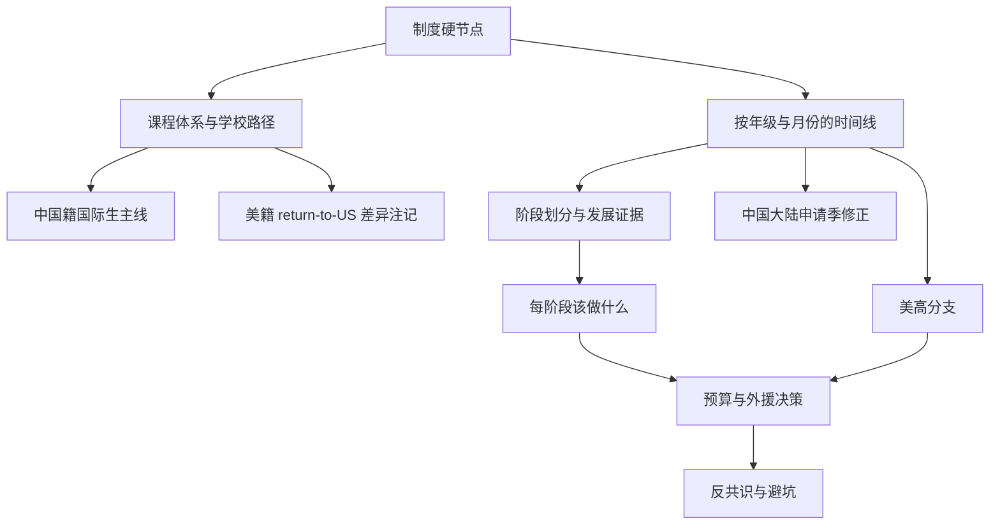

# 美本路线图研究大纲与主要数据源清单

## 执行摘要

这份研究会按你的设定，把**中国籍国际生**作为主线来做，核心骨架不是“机构常见阶段包”，而是**官方可验证的硬节点**：课程体系与学籍路径、标化考试窗口、学校/顾问提交材料、早申与常规申截止、录取后 I-20/签证/财力文件等。当前已经锁定的官方源足以把这一骨架搭起来：Common App、College Board、ACT、IB、Cambridge、EducationUSA、DHS Study in the States，以及 Harvard/Yale/Princeton/MIT 和顶级寄宿中学的招生页面。citeturn16search3turn16search0turn16search4turn11search2turn13search18turn13search1turn4search3turn4search12turn4search0turn12search0turn12search1turn30search0turn30search2turn30search17turn5search5

同一时间，初步检索已经证明：**“顶校都一个规则”这种说法现在不成立**。Harvard 当前要求 SAT/ACT，但在无法接触这些考试时可用 AP、IB、A-Level/GCSE 或其他 externally assessed leaving exams 替代；MIT 直接要求 SAT/ACT；Yale 是 test-flexible，可用 ACT、SAT、AP、IB；Princeton 已宣布自 **2027–28** 申请周期起恢复要求 SAT/ACT。最终报告不能再用泛泛的“test-optional 时代策略”去覆盖所有学校。citeturn30search0turn30search1turn30search2turn5search5

对低龄阶段，最强证据不会来自招生办，而会来自**发展心理学、儿科与幼教权威**：AAP 与 NAEYC 对早期发展、游戏、whole-child、developmentally appropriate practice 的证据较强；进入青春期后，证据主轴转向**身份探索、发展转折点、自主支持、过早专业化风险**。因此最终报告会故意把 **G1–G8** 的建议和 **G9–G12** 的申请动作分开论证，不会把后者提前硬塞到前者身上。citeturn18search12turn18search13turn18search0turn7search1turn19search0turn19search5turn20search0turn20search6turn7search3turn7search15

## 研究框架

主线仍是你指定的“中国籍国际生到美本”的长期规划，但我会在每个制度性节点旁边加**return-to-US 差异注记**，重点只落在真正会改变路径的地方：是否需要 F-1/I-20、是否可填 FAFSA、CSS Profile 填法、国际/国内 testing logistics、以及部分 K–12/大学申请中 citizenship/residency 的表单与资助差异。EducationUSA、Study in the States、CSS Profile 与 Federal Student Aid 的官方材料已经能支持这类差异化注记。citeturn12search0turn12search1turn12search2turn28search0turn28search13turn28search22turn28search17

我会把证据分成四档来写，避免把“有经验的顾问直觉”和“同行评议证据”混在一起：

| 证据等级 | 采用标准 | 在最终报告中的用途 |
|---|---|---|
| 强 | 官方 requirement/policy、权威机构指南、同行评议综述/系统综述、学校官方 deadline/requirement 页面 | 直接作为“必须发生/不该乱说”的结论依据 |
| 中 | 顶级从业者署名文章、招生办公室官方博客/播客、College Counseling office 公开材料 | 用来解释节奏、语境、实践差异 |
| 薄弱 | 单校个案、非综述研究、机构经验贴 | 仅作为补充，不单独支撑强结论 |
| 无共识 | 官方不说、研究不一致、只有营销内容 | 明确写“我们不知道” |

## 完整报告大纲

最终完整稿会按下面这套结构展开，而不是按传统留学机构的“低龄段/中学段/冲刺段”营销切片来写：

| 最终章节 | 要回答的问题 | 第一优先证据 |
|---|---|---|
| 执行摘要 | 哪些是必须做、哪些是弹性、哪些是坑 | 官方政策页、综述文献 |
| 全程时间线 | 从 G1 到申请季，真正有 deadline 的只有哪些节点 | Common App、College Board、ACT、招生办日程页 |
| 阶段划分 | 发展阶段怎么切，行业常见分段哪里有证据、哪里是营销简化 | AAP、NAEYC、WHO、身份发展/自主支持研究，辅以 NACAC/IECA/校内 counseling practice |
| 每阶段行动建议 | G1–G3、G4–G8、G9–G12 该做什么、别做什么 | 发展研究 + 官方招生要求 |
| 美高分支 | 什么时候是合理转轨窗；走美高 vs 国内国际学校到 G12 的 trade-off | 顶级寄宿校申请页 + 大学招生要求 + college counseling office 材料 |
| 预算信号 | 哪些是 inelastic，哪些是 elastic，哪些看起来贵但 admission signal 弱 | 考试/申请/资助官方页 + 顾问伦理规范 |
| 顾问与外援 | 什么时候 DIY 足够，什么时候找 IEC 值得；如何识别中介销售话术 | NACAC/IECA 伦理与会员标准 |
| 中国语境修正 | 中国大陆考点、寄递、签证、文书/面试中的中文母语与成长背景如何处理 | College Board/ACT/Study in the States/EducationUSA/大学官方 advice |

## 主要数据源清单

**制度与时间节点**

| 模块 | 代表来源 | 会提取的信息 |
|---|---|---|
| 通用申请系统 | Common App first-year guide、requirements grid、counselor/recommender system citeturn16search3turn16search0turn16search4 | 各校 deadline 类型、supplement、school report/transcript/recommendation workflow、国际申请共同材料框架 |
| SAT | College Board SAT dates/deadlines、international testing、test center search、registration guidance citeturn11search2turn11search11turn13search0turn13search18 | SAT 官方时间窗、国际考位逻辑、官方建议首考/再考窗口 |
| ACT | ACT registration、test-center locator、international guidance citeturn13search19turn13search1turn13search17 | ACT 报考与考点选择规则、国际考生现实约束 |
| AP | AP courses、AP choosing-courses、AP exam terms/score pages citeturn4search3turn4search11turn26search3turn26search4 | AP 课程供给、常见起始年级、考试节奏、AP 与 admission/college outcomes 的官方研究材料 |
| IB | IBO Diploma Programme curriculum citeturn4search12 | IB DP 两年结构及课程核心要求 |
| A-Level | Cambridge AS/A Level curriculum/timetables、Pearson IAL timetables citeturn4search0turn4search12turn4search13turn4search1turn4search6 | A-Level / AS 的典型时长、考试系列与月度节奏 |
| 国际生总体流程 | EducationUSA “5 Steps to U.S. Study” 与 application/visa pages citeturn12search0turn12search2turn12search10turn12search16 | 国际生从选校到签证的官方流程框架 |
| 录取后文件 | DHS Study in the States Form I-20 pages citeturn12search1turn12search3turn12search5 | 中国籍国际生录取后必须经历的 I-20/SEVIS 节点 |
| 资助表单 | CSS Profile international/getting started/fee-waiver pages、FAFSA citizenship requirement page citeturn28search0turn28search13turn28search21turn28search22 | 国际生 vs 美籍/eligible noncitizen 在 aid 表单上的关键差异 |

**大学招生官方页**

| 院校/系统 | 代表来源 | 会提取的信息 |
|---|---|---|
| Harvard | admissions、first-year applicants、application requirements、international applicants、preparing for college、FAQ citeturn33search2turn33search5turn30search0turn21search0turn17search4turn17search8 | Deadline、课程准备、国际生 testing/English/translated materials、学校对 rigor 的官方口径 |
| Yale | apply、timelines、requirements、standardized testing、international、what Yale looks for、recommendation letters、essay pages/podcast citeturn33search3turn33search0turn30search5turn30search2turn30search18turn17search1turn21search1turn23search0turn23search12 | SCEA/RD 节点、课程/推荐信/文书/测试的官方偏好 |
| Princeton | before you apply、application dates & deadlines、application checklist、international students、testing、helpful tips、graded written paper citeturn22search18turn33search1turn33search11turn24search0turn5search5turn23search3turn23search15 | 当前与下一周期 testing policy、推荐课程、graded paper、国际生要求 |
| MIT | deadlines & requirements、tests & scores、international applicants、essays/activities/academics、admissions stats、academic foundations citeturn30search4turn30search1turn30search17turn23search2turn30search23turn17search2 | MIT 专属 timing、测评、学术准备与真实分数区间 |
| Common Data Set benchmark schools | Harvard/Yale/Princeton/MIT/Stanford/Penn official CDS pages citeturn6search0turn5search3turn6search8turn29search11turn29search1turn29search2 | 选取基准院校时的官方 selectivity/scores/enrollment 数据，而不是二手榜单口径 |

**美高与 K–12 分支官方页**

| 分支 | 代表来源 | 会提取的信息 |
|---|---|---|
| 顶级寄宿中学 | Andover apply、Exeter apply、Deerfield apply、Lawrenceville application process、Hotchkiss apply/how-to-apply/FAQ citeturn35search0turn9search4turn34search1turn34search2turn3search1turn3search9turn34search3 | 申请启动时间、deadline、面试窗口、testing 要求、成绩发布时间、entry-grade 现实路径 |
| 美高申请考试系统 | SSAT/Gateway to Prep Schools official pages citeturn27search5turn27search2turn27search4turn27search3turn27search1 | SSAT、Gateway 的官方流程、国际地区可用性、score release、deadline mechanics |
| 顶级走读私校示例 | Trinity admissions、Horace Mann admissions/apply pages citeturn3search2turn3search3turn3search7turn3search11 | 走读私校与寄宿校不同的秋季申请/面试节奏 |

**发展心理学与教育心理学**

| 主题 | 代表来源 | 会提取的信息 |
|---|---|---|
| 早期发展与 whole-child | AAP Early Childhood、AAP Power of Play、NAEYC DAP position statement/principles citeturn18search12turn18search0turn7search1turn18search13 | G1–G3 应以语言、关系、游戏、探索、执行功能、情绪发展为主，而不是申请导向活动堆量 |
| 青春期定义与转折点 | WHO adolescent health、Chaku 2024、Blum 2014、Christie 2005 citeturn19search0turn19search5turn19search10turn19search3 | 为什么 10–14 和 15–18 的策略差异需要单独写，而不能一刀切 |
| 身份探索与承诺 | Branje 2021、Pfeifer 2018、Klimstra 2009 citeturn20search0turn20search7turn20search4 | “兴趣探索 vs 过早固化” 的理论基础 |
| 自主支持与动机 | parental autonomy support / SDT 相关研究与元分析 citeturn20search6turn20search25turn20search29 | 家长如何支持而不夺权，哪些控制型做法可能伤害内在动机 |
| 过早专业化风险 | Jayanthi 2019、Brenner 2019、Mosher 2021 citeturn7search3turn7search15turn7search11 | “很早锁一个赛道并持续高压投入” 的风险证据 |
| 课外活动的真实作用 | Fredricks 2010、Boelens 2021、Feldman 2021 等 citeturn8search3turn37search2turn37search9 | 课外活动对发展有正向价值，但更像长期发展变量，不是低龄 admissions weapon |

**顾问、伦理与行业识别**

| 主题 | 代表来源 | 会提取的信息 |
|---|---|---|
| NACAC 伦理框架 | Guide to Ethical Practice、IEC directory、ethical practices materials citeturn14search2turn14search5turn14search11turn31search3 | 如何界定顾问/中介的伦理红线、透明度与责任 |
| IECA 会员标准 | IECA Principles of Good Practice、join/professional requirements、campus visit requirements citeturn14search0turn14search3turn14search4turn14search7 | 如何识别“真正职业化 IEC”与销售型咨询 |
| 招生代理与佣金问题 | NACAC commissioned agents series citeturn14search17turn14search8 | 国际招生代理、佣金、披露义务等敏感问题的官方职业讨论 |
| 从业者实践补充 | Anne Holmdahl, *A Hands-Off Approach to College Counseling*；NACAC Journal/教材页 citeturn32view0turn31search1turn31search5 | 用作中等证据：了解美国本土高质量顾问如何把低年级节奏做得“轻而连续”，而不是签超长重服务合同 |

## 初步发现与待核实问题

已经可以确认的一个结论是：**高阶段时间线很清楚，低阶段“申请化”证据并不强**。官方大学材料明确告诉学生：高中 transcript、课程 rigor、近年的核心学科推荐信、真实文书声音、以及在申请季前完成 testing 才是高段的核心硬件；College Board 也明确把 SAT 的通常首考放在 11 年级春季，而不是小学/初中低龄启动。citeturn17search1turn21search1turn24search12turn23search3turn23search2turn13search18

另一个高置信发现是：**美高分支确实是重要节点，但不是必经主线**。顶级寄宿校当前官方页面显示，申请通常在秋季完成 profile/面试，**1 月 15 日或 2 月 1 日** 前后交齐材料，决定多在 **3 月** 释放；而 Trinity、Horace Mann 这类顶级走读私校又有更早的秋季预约/面试节奏。也就是说，美高分支适合被写成 **G7–G9 的可选转轨窗口**，不适合写成所有中国家庭的默认路径。citeturn35search0turn9search4turn34search1turn34search2turn3search1turn3search2turn3search3

对中国语境，初步材料足以支持**流程修正**，但未必足以支持**国籍/地域分池录取率的精确数字化**。当前已经锁定的官方源非常适合回答 testing logistics、表单差异、I-20/签证步骤、国际资助流程；但最终是否能做出“某校中国籍国际生 vs 美籍海外生”的学校级数字表，要看是否能在官方公开数据里找到一致口径，否则就必须明确写“无共识/公开证据不足”，而不能用机构二手数。citeturn13search0turn13search1turn12search1turn28search0turn6search0turn5search3turn6search8turn29search11

本阶段我已经确定，完整报告里会特别谨慎处理三类问题。第一，**“越早越好”的低龄升学规划**，目前更可能是营销命题，需要用发展证据与实际 admissions nodes 对冲。第二，**AP/IB/A-Level 谁天然更强**，官方大学口径更强调“在你所在体系内做到最高 rigor”，而不是简单排座次。第三，**文书里的中国背景**，最终会优先依据 Yale/Harvard/Princeton/MIT 对 authentic voice、course context、teacher letters、international materials 的官方说明来写，避免把“中文母语优势”写成没有证据的套路公式。citeturn18search13turn19search5turn24search4turn24search8turn24search6turn23search1turn23search3turn23search2turn21search1